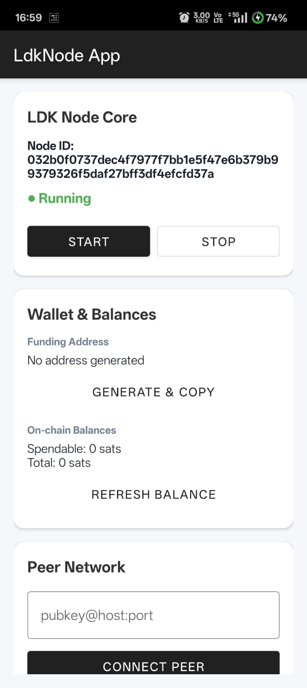
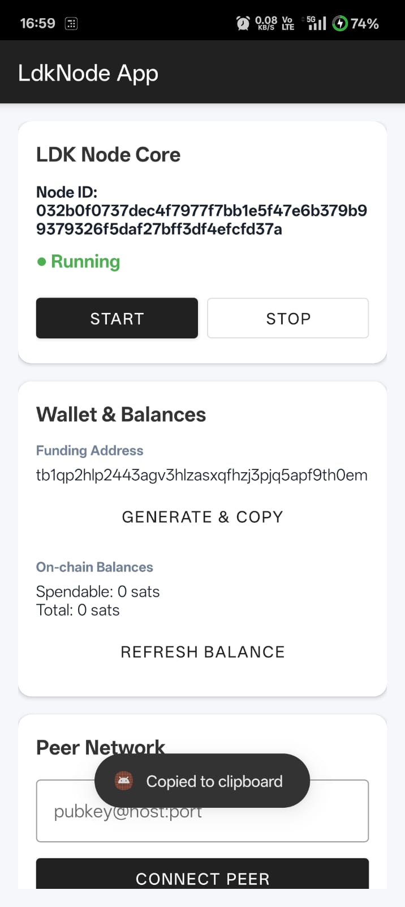
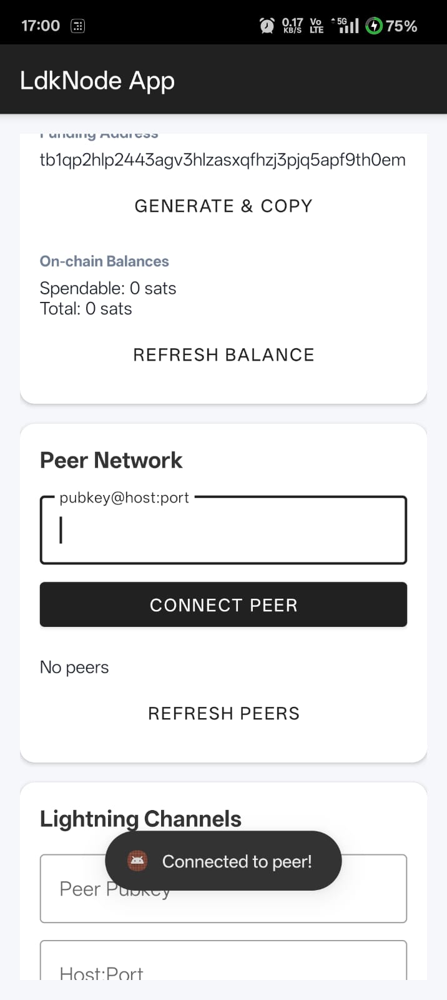
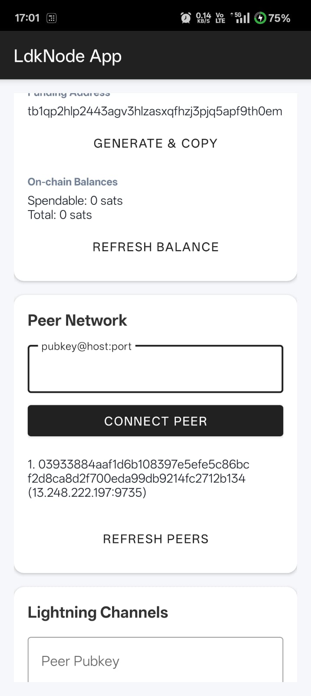

# LDK Node Android Competency Demo

This repository contains a fully functional Android application demonstrating a complete integration of the [LDK Node](https://lightningdevkit.org/) library using its Kotlin JVM bindings. It serves as a proof-of-competency for a Summer of Bitcoin project proposal.

## Features

This demo implements the LDK Node lifecycle across three tiers:

### Tier 1: Core Node Lifecycle
* **Start/Stop Engine:** Control the background Lightning daemon securely with off-main-thread execution.
* **Persistent Identity:** Cryptographic secrets and the Node ID are saved to the device's persistent storage, surviving app restarts.
* **Wallet Management:** Generate on-chain Testnet funding addresses and instantly copy them to the clipboard.
* **Balances:** Fetch and display both `spendable` and `total` on-chain Testnet balances directly from the LDK node.

### Tier 2: Peer Network
* **Connect:** Establish outbound TCP connections to remote Lightning Network peers using standard `pubkey@host:port` formatting.
* **Discover:** Request and display a real-time aggregated list of all currently connected peers directly from the Node's active sessions.

### Tier 3: Lightning Channels
* **Open Channels:** Form-based UI to initiate the `openChannel` process with a remote peer, correctly mapping JVM unsigned longs (`ULong`) for channel capacity and push amounts.

## Screenshots

  
  
  
  

## Architecture & Technical Decisions

* **Network**: The node is strictly configured to run on `TESTNET`.
* **Esplora Backend**: Chain synchronization and fee estimation are powered by `https://mempool.space/testnet/api`.
* **Coroutines**: All JNI operations (`node.start()`, `node.connect()`, etc.) are wrapped in `lifecycleScope.launch(Dispatchers.IO)` to prevent main-thread blocking and Application Not Responding (ANR) errors.
* **Modern UI**: Built dynamically using `MaterialCardView` and `MaterialButton` for a clean, legible, and highly elevated user experience.

## Getting Started

1. Clone this repository.
2. Open the project in **Android Studio**.
3. Sync Gradle dependencies.
4. Run the app on a physical device or emulator running SDK 26+ (`./gradlew installDebug`).
